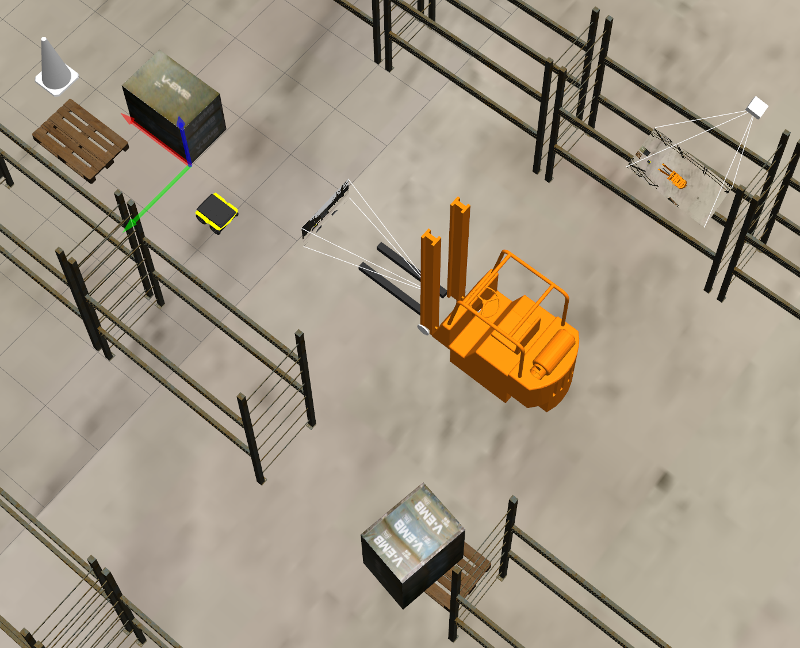
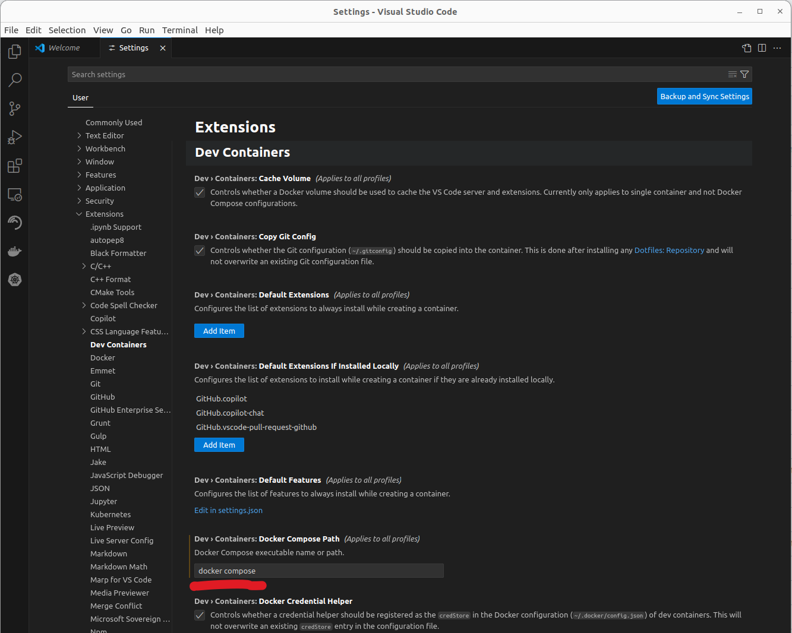

# SIMLAN, Simulation for Indoor Multi-Camera Localization and Navigation (1.0.4)

This simulation environment, based on the Gazebo simulator and ROS2, resembles a Volvo trucks' warehouse and serves as a playground for rapid prototyping and testing indoor multi-camera localization, positioning, and navigation algorithms. While this environment can be utilized for Multi-Sensor SLAM (Simultaneous Localization and Mapping) using cameras, IMUs, GPS, lidar, and radar *mounted on the robot*, the focus of this project is *not* on mapping but on assuming a *fixed building layout* and using fixed cameras *mounted on the ceiling*.

### Volvo factory

[Click here to see the Volvo factory demo](https://www.youtube.com/watch?v=f8ULCZFEM5Q):

[](https://www.youtube.com/watch?v=f8ULCZFEM5Q)

### Small Warehouse

[Video demo 1](resources/demo1.mp4)
,
[Video demo 2](resources/demo2.mp4)


## Overview of Project Structure

- `README.md` : you are reading this file

- [`start.sh`](start.sh) : control script as a shortcut to run different scripts

- [`simulation/`](simulation/) : models, urdf and launch script for objects and agents in the gazebo simulator

  - [`README.md`](simulation/README.md) : simulation and warehouse specification
  - `infobot_agent/`
  - `object_mover/`
  - `raw_models/`
    - [`README.md`](simulation/raw_models/README.md) : building Gazebo models (Blender/Phobos)
    - [`objects/README.md`](simulation/raw_models/objects/README.md) : objects specifications
    - [`warehouse/README.md`](simulation/raw_models/warehouse/README.md) : warehouse specification
  - `simlan_gazebo_environment/`
  - `static_agent_launcher/`
    *Dependencies*: `vscode` (with `Dev containers` extension installed) and `docker` with `nvidia-container-runtime` and `nvidia-docker2` package installed. Make sure the you see nvidia when you run `docker info|grep -i runtime` like below:

```
$ docker info|grep -i runtime
 Runtimes: nvidia runc
 Default Runtime: runc
```

Also make sure to accept the installation of all vscode extensions when you open the project.

- [`processing/`](processing/): to positions cameras in simulator and processing images from simulation

  - [`camera_data/`](processing/camera_data/) : camera data stored here

  - [`extrinsic/`](processing/extrinsic/) : extrinsic camera calibration

  - [`intrinsic/`](processing/intrinsic/) : intrinsic camera calibration

  - [`projection.ipynb`](processing/projection.ipynb) : how to use camera calibration to project images to the ground plane

  - [`camconf2xacro.sh`](processing/camconf2xacro.sh): to update camera calibration in simulator

  - [`calibration.py`](processing/calibration.py) : to load and convert OpenCV calibration file

  - [`camera_subscriber.py`](processing/camera_subscriber.py) : script to read images from ROS2 topics

  - [`README.md`](processing/README.md) : to learn what processing is done on images

  - `rviz_config.rviz`

- [`control/`](control/): to control the agents

  - `infobot_navigation2/`
  - `infobot_teleop/`
  - `maps/`
  - `nav2_commander/`

- [`resources/`](resources) : images , videos and documents are placed here (no code should be stored here)

- [`deployment/`](deployment) : CI/CD scripts for jenkins and k8s

- [`docker-compose.yaml`](docker-compose.yaml) : disable and enable nvidia gpu

- [`ISSUES.md`](ISSUES.md) : please check known issues before reporting any issue

- `ros2_tests` : ROS2 tests

- [`requirements.txt`](requirements.txt) : python (pip) dependencies

- [`CHANGELOG.md`](CHANGELOG.md)

- [`CREDITS.md`](CREDITS.md)

- `LICENSE`

- [`BUILD.md`](BUILD.md) : to build the project outside vscode

## Installation (in development environment)

*Dependencies*: `git`, `curl` and `vscode` (with `Dev containers` extension installed) and `docker`

Make sure docker is installed correctly by following these two instructions:

- [Install docker using the convenience script](https://docs.docker.com/engine/install/ubuntu/#install-using-the-convenience-script)
- [Linux post-installation steps for Docker Engine](https://docs.docker.com/engine/install/linux-postinstall/)

To summarize you can use these commands to install docker and ensure that your user has access to docker:

```
 curl -fsSL https://get.docker.com -o get-docker.sh
 sudo sh get-docker.sh

 sudo groupadd docker
 sudo usermod -aG docker $USER
 newgrp docker
```

### Setting up vscode

One all dependencies are installed, open the project in the vscode. Please make sure to accept the installation of all vscode extensions when you open the project.

If you have any issue with docker incompatibility (e.g. `Error: Command failed: docker compose ...`), make sure that `docker compose` or `docker-compose` is set correctly in the setting.


Additionally you are requested to rebuild in the container that you should also accept. This make take couple of minutes. Run these commands in the vscode terminal after vscode is connected to the docker as shown in image below:


(if you don't see this try to build manually in vscode by pressing `Ctrl + Shift + P` and select `Dev containers: Rebuild and Reopen in container`.
)

### GPU support

To improve speed you can enable the support for nvidia GPU. To use nvidia GPU make sure `nvidia-cuda-toolkit`  is installed. Otherwise try to install [`nvidia-container-runtime`](https://docs.nvidia.com/datacenter/cloud-native/container-toolkit/latest/install-guide.html#installing-with-apt) and `nvidia-docker2` packages.

`docker info|grep -i runtime` like below:

```
$ docker info|grep -i runtime
 Runtimes: nvidia runc
 Default Runtime: runc
```

Otherwise you get the following error message: `Error response from daemon: unknown or invalid runtime name: nvidia`

Then update `docker-compose.yaml` and `.devcontainer/devcontainer.json`

```
{
    "name": "ROS2 RESEARCH CONTAINER",
    "dockerComposeFile": "../docker-compose.yaml",
    "service": "factory_simulation_nvidia
...
```

if you still have any problem please check [ISSUES.md](ISSUES.md) before opening any issue.

## Quick start

To kill all relevant process (related to gazebo, ros2), delete build files, delete recorded images and rosbag files using the following command:

*Attention*: run these commands in a parallel terminal within _vscode_.

```bash
./start.sh clean
```

To clean up and build the ros2 simulation

```bash
./start.sh build
```

To kill previously running simulation instances, build the project and start the simulation environment and agents(spawn robots, Aruco marks and cameras on the scene) run the following command and you should be able to see the Gazebo graphical simulation window:

```bash
./start.sh sim
```

To record camera images for available cameras we use a simple python code [./processing/camera_subscriber.py](./processing/camera_subscriber.py) that continuously record camera images in `processing/camera_data/` :

```bash
./start.sh cam_dump
```

## Advance features

These features and commands are under development and not fully supported yet and therefore are subject to change.

The jackal can then be controlled with the computer keyboard by running:

```bash
./start.sh teleop_jackal
```

To control the infobot using keyboard:

```bash
./start.sh teleop_infobot
```

To record one screenshot after use:

```bash
./start.sh screenshot 164
```

The result will be stored in `./processing/camera_data/`.

To record ros messages in ROS bag files to replay the scenario later:

```bash
./start.sh ros_record
```

To replay the last rosbag recording:

```bash
./start.sh ros_replay
```

(optionally) To do cartography:

```bash
./start.sh slam
```

To start nav2 navigation stack and start commanding the infobot to move in the map:

```bash
./start.sh nav
```

and then:

```bash
./start.sh commander
```

To test the unit tests before pushing new codes:

```bash
./start.sh test
```

### Research Funding

This work was carried out within these research projects:

- The [SMILE IV](https://www.vinnova.se/p/smile-iv/) project financed by Vinnova, FFI, Fordonsstrategisk forskning och innovation under the grant number 2023-00789.
- The EUREKA [ITEA4](https://www.vinnova.se/p/artwork---the-smart-and-connected-worker/) ArtWork - The smart and connected worker financed by Vinnova under the grant number 2023-00970.
