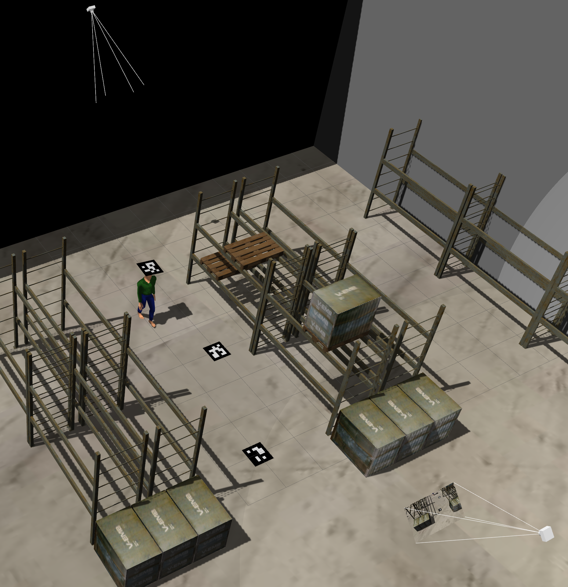
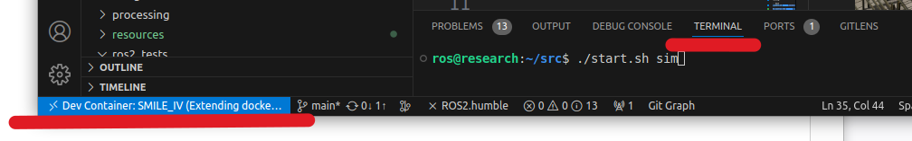

# SIMLAN, Simulation for Indoor Multi-Camera Localization and Navigation

This simulation environment, based on the Gazebo simulator and ROS2, resembles a Volvo trucks' warehouse and serves as a playground for rapid prototyping and testing indoor multi-camera localization, positioning, and navigation algorithms. While this environment can be utilized for Multi-Sensor SLAM (Simultaneous Localization and Mapping) using cameras, IMUs, GPS, lidar, and radar *mounted on the robot*, the focus of this project is *not* on mapping but on assuming a *fixed building layout* and using fixed cameras *mounted on the ceiling*.

Find technical and more detailed documentation and specifications in the following links:

- [Simulation](simulation/README.md)
- [Building Gazebo models (Blender/Phobos)](simulation/raw_models/README.md)
- [Objects specifications](simulation/raw_models/objects/README.md)
- [Warehouse specification](simulation/raw_models/warehouse/README.md)
- [Camera extrinsic calibration](processing/extrinsic) and [Camera intrinsic calibration](processing/intrinsic)



[video demo 1](resources/demo1.mp4)
,
[video demo 2](resources/demo2.mp4)

Click on image below to see the Volvo layout demo:

[](https://www.youtube.com/watch?v=f8ULCZFEM5Q)

## Installation in development environment

*Dependencies*: `vscode` (with `Dev containers` extension installed) and `docker`. Make sure to accept installation of vscode extensions when you open the project.
Additionally you are requested to rebuild in the container that you should also accept. This make take couple of minutes. Run these commands in the vscode terminal after vscode is connected to the docker as shown in image below:


(if you don't see this try to build manually in vscode by pressing `Ctrl + Shift + P` and select `Dev containers: Rebuild and Reopen in container`.
)
To kill all relevant process (related to gazebo, ros2), delete build files, delete recorded images and rosbag files using the following command:

```bash
./start.sh clean
```

To clean up and build the ros2 simulation

```bash
./start.sh build
```

To kill previously running simulation instances, build the project and start the simulation environment and agents(spawn robots, Aruco marks and cameras on the scene) run the following command and you should be able to see the Gazebo graphical simulation window:

```bash
./start.sh sim
```

*Attention*: run these commands in a parallel terminal within _vscode_ .

the jackal can then be controlled with the computer keyboard by running:

```bash
./start.sh teleop_jackal
```

To control the infobot using keyboard:

```bash
./start.sh teleop_infobot
```

To record camera images for available cameras we use a simple python code [./processing/camera_subscriber.py](./processing/camera_subscriber.py) that can be executed with following command:

To record continuously:

```bash
./start.sh cam_record 164
```

To record one screenshot:

```bash
./start.sh screenshot 164
```

The result will be stored in `./processing/camera_data/`.

## Advanced features (not fully supported yet):

To record ros messages in ROS bag files to replay the scenario later:

```bash
./start.sh ros_record
```

To replay the last rosbag recording:

```bash
./start.sh ros_replay
```

(optionally) To do cartography:

```bash
./start.sh slam
```

To start nav2 navigation stack and start commanding the infobot to move in the map:

```bash
./start.sh nav
```

and then:

```bash
./start.sh commander
```

To test the unit tests before pushing new codes:

```bash
./start.sh test
```

### Additional information

Please see [LICENSE](LICENSE), [CREDITS.md](CREDITS.md) and [CHANGELOG.md](CHANGELOG.md) for more information.

This work was carried out within these projects:

- the [SMILE IV](https://www.vinnova.se/p/smile-iv/) project financed by Vinnova, FFI, Fordonsstrategisk forskning och innovation under the grant number 2023-00789.
- the EUREKA [ITEA4](https://www.vinnova.se/p/artwork---the-smart-and-connected-worker/) ArtWork - The smart and connected worker financed by Vinnova under the grant number 2023-00970.
