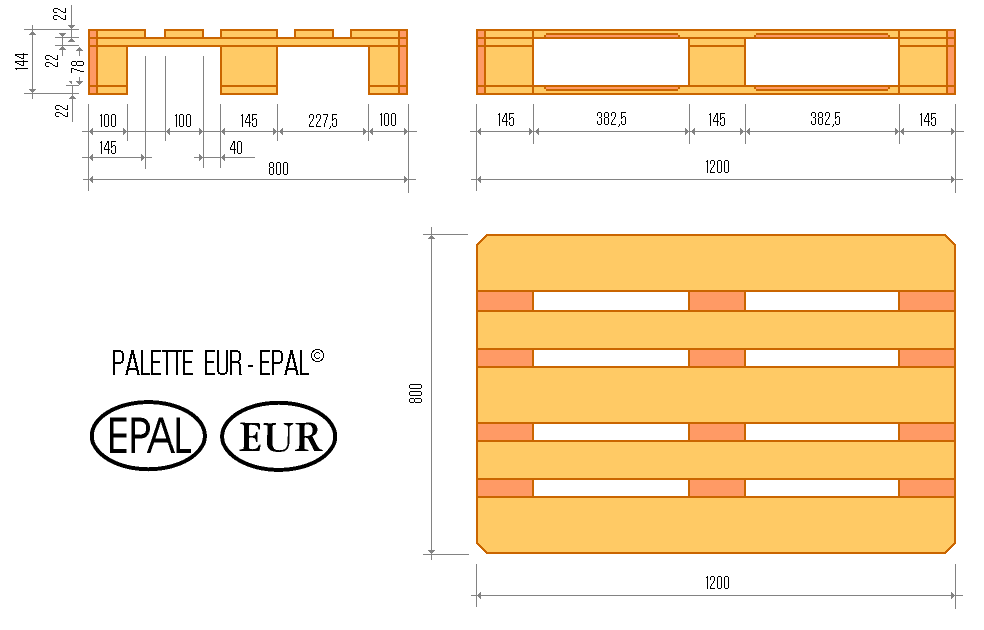
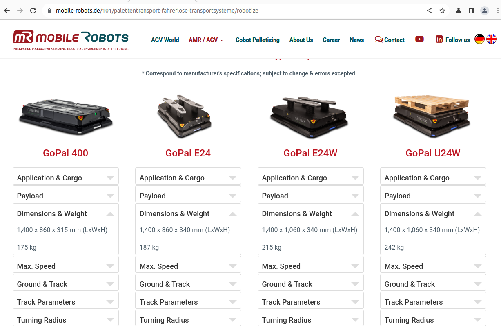
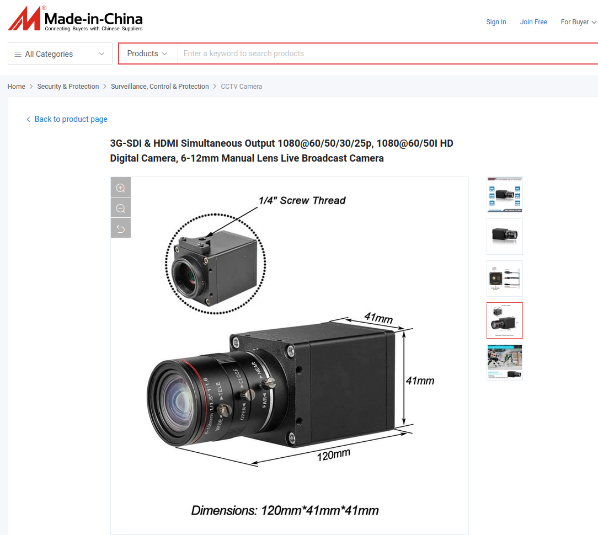

## Blueprint

This document contains explanations and motivations for the measurements as well as names for variables that should be used when designing the objects. The categories are mostly self explanatory, the one that might need more of an explanation is the color red. This refers to loose objects such as pallets, barrels, boxes and things that will be placed directly on the ground.

**Measurements:**

| Category     | Part / Object |       Variable Name       |   Value \[unit\] |
| :----------- | :-----------: | :-----------------------: | ---------------: |
| Shelf        |   Load Beam   |        beam_length        |        2.7 \[m\] |
| Shelf        |   Load Beam   |        beam_depth         |       0.05 \[m\] |
| Shelf        |   Load Beam   |        beam_height        |       0.14 \[m\] |
| Shelf        |   Load Beam   |        beam_weight        |      15.2 \[kg\] |
| Shelf        |   Footplate   |     footplate_length      |      0.111 \[m\] |
| Shelf        |   Footplate   |      footplate_width      |        0.1 \[m\] |
| Shelf        |   Footplate   |     footplate_height      |      0.004 \[m\] |
| Shelf        | Stand / Pole  |       stand_length        |       0.07 \[m\] |
| Shelf        | Stand / Pole  |        stand_width        |       0.08 \[m\] |
| Shelf        | Stand / Pole  |       stand_height        |          3 \[m\] |
| Shelf        | Stand / Pole  |       stand_weight        |       8.5 \[kg\] |
| Shelf        |  Cross Brace  |       brace_length        |       0.96 \[m\] |
| Shelf        |  Cross Brace  |        brace_width        |       0.01 \[m\] |
| Shelf        |  Cross Brace  |       brace_height        |       0.02 \[m\] |
| Shelf        |  Cross Brace  |       brace_weight        |         1 \[kg\] |
| Loose Object |  EUR-Pallet   |     EUR_pallet_length     |        1.2 \[m\] |
| Loose Object |  EUR-Pallet   |     EUR_pallet_width      |        0.8 \[m\] |
| Loose Object |  EUR-Pallet   |     EUR_pallet_height     |      0.144 \[m\] |
| Loose Object |  EUR-Pallet   |     EUR_pallet_weight     |        25 \[kg\] |
| Loose Object |  Steel Drum   |     steel_drum_radius     |        0.3 \[m\] |
| Loose Object |  Steel Drum   |     steel_drum_height     |        0.9 \[m\] |
| Loose Object |  Steel Drum   |  full_steel_drum_weight   |       188 \[kg\] |
| Loose Object |  Steel Drum   |  empty_steel_drum_weight  |        15 \[kg\] |
| Loose Object | Traffic Cone  |    traffic_cone_radius    |       0.22 \[m\] |
| Loose Object | Traffic Cone  |    traffic_cone_angle     |  -10 \[degrees\] |
| Loose Object | Traffic Cone  | traffic_cone_total_height |          1 \[m\] |
| Loose Object | Traffic Cone  | traffic_cone_base_length  |       0.52 \[m\] |
| Loose Object | Traffic Cone  |  traffic_cone_base_width  |       0.52 \[m\] |
| Loose Object | Traffic Cone  | traffic_cone_base_height  |       0.03 \[m\] |
| Loose Object | Traffic Cone  |  traffic_cone_base_angle  |  -20 \[degrees\] |
| Loose Object | Traffic Cone  |    traffic_cone_weight    |       6.5 \[kg\] |
| Loose Object |      Box      |        box_length         |     Varies \[m\] |
| Loose Object |      Box      |         box_width         |     Varies \[m\] |
| Loose Object |      Box      |        box_height         |     Varies \[m\] |
| Loose Object |      Box      |        box_weight         |     Varies \[m\] |
| Warehouse    | Support Pole  |        pole_length        |        0.3 \[m\] |
| Warehouse    | Support Pole  |        pole_width         |        0.3 \[m\] |
| Warehouse    | Support Pole  |   pole_hole_side_length   |       0.27 \[m\] |
| Warehouse    | Support Pole  |   pole_hole_side_width    |       0.13 \[m\] |
| Warehouse    | Support Pole  |        pole_height        |          6 \[m\] |
| Warehouse    | Support Pole  |        pole_weight        | Undefined \[kg\] |

|  |
| :-----------------------------------: |
|       *EUR-pallet Measurements*       |

## AMR

It is defined in XY plane and the center of the AMR is on x,y=0,0 and the bottom of the robot is on z=0.

Define **scale** , **pos** and collision in these files:

We write our AMR description in `infobot_gazebo_environment/urdf` and use `xacro` to create a `urdf` file with gazebo tags (so not a pure urdf file) that can be used both by `state_publisher` and `gazebo` (unlike 2 separate files  `model.sdf` that is used for Gazebo and `turtlebot.urf` that is used for state_publisher in original Turtlebot_simulation git project.

There are two actual diffdrive wheels that are named `left` and `right` and four supporting wheel to balance the robot that are named `front_left`, `front_right` and `back_left` and `back_right` (they have no friction and can be moved to different position) with the radius of 0.98 of the main wheels.

**Note**: The reason for the shake is difference between the radius of the real wheels and caster wheels

### Infobot AMR specification

Orientation:

- x : forward
- y: left
- z: up

## Objects Modeled in FreeCAD

All the objects are located in `objects`. Below follows a list of the objects currently available, models created in FreeCAD.

- EUR-pallet
- Shelf
- Modular Shelf - a stackable shelf part that can create shelves of varying size
- Steel Drum
- Traffic Cone
- Support Pole
- Boxes with measurements in mm \[Box-Length x Width x Height\]
  - Box-160x130x70
  - Box-185x185x75
  - Box-185x185x185
  - Box-210x180x130
  - Box-230x160x85
  - Box-250x195x160
  - Box-430x250x260
  - Box-440x320x175
  - Box-570x380x380
  - Box-1185x785x1010
  - Box-600x800x400 (2 per level on EUR-Pallet)
  - Box-600x400x400 (4 per level on EUR-Pallet)
  - Box-300x400x400 (8 per level on EUR-pallet)

## AMR camera

Inspired by  [CCTV Camera 3G-SDI](https://sz-camera.en.made-in-china.com/productimage/OxfRauwdhIcY-2f1j00jPcbKhZkSIoC/China-3G-SDI-HDMI-Simultaneous-Output-1080-60-50-30-25p-1080-60-50I-HD-Digital-Camera-6-12mm-Manual-Lens-Live-Broadcast-Camera.html)

In the model: camera base height(70mm) + camera lense height(50mm) = 120mm

## Resources

- [Pallet Rack Specification & Configuration Guide](https://www.cisco-eagle.com/category/3051/selective-rack-configuration)
- [Pallet Rack Estimator](https://webtools.cisco-eagle.com/rack/)
- [Pallet rack configurator](https://www.topregal.com/en/pallet-racks/configurator/)
- [pallet](https://app.gazebosim.org/search;q=Pallet)
- Shelf typical measurements: [Shelf Measurements](https://arkerwarehouse.com/standard-upright-sizes/#:~:text=The%20most%20common%20upright%20depth,is%208'%20to%2024')
- Forklift height which influences Shelf height: [Forklift Height](https://www.bigrentz.com/blog/dimensions-of-forklift#:~:text=Forklift%20heights%20can%20span%20anywhere,is%20about%2013.5%2D14.5%20feet.)
- EUR-pallet: [EUR-pallet](https://www.svenskttra.se/bygg-med-tra/traforpackningar/val-av-emballagetyp/lastpallar/#:~:text=EUR%2Dpallen%20med%20m%C3%A5tten%20800,lastpallen%20%C3%B6verstiga%205%20500%20kg.)
- Shelf design: [Shelf design](https://www.topregal.com/en/pallet-racks/configurator/)
- Shelf exact measurements: [Shelf exact measurement](https://www.topregal.com/out/media/29386_tdb_INT_PR9000.pdf)
- Examples of boxes: [Boxes Examples](https://wulffsupplies.se/produkter/emballage/emballage/wellador-och-kartonger/)
- Measurement for steel drum: [Steel Drum](https://eshop-best-chemical.com/products/210-litres-tight-head-steel-drum-with-pe-gasket-grey)
- Full Steel drum weight is based on the oil density of 825kg/m^3 and the drum fits 210 liters.
- Some values helping in constructing the traffic cone: [Traffic Cone](https://www.roadware.co.uk/starlite-1-meter-road-traffic-cones/)
