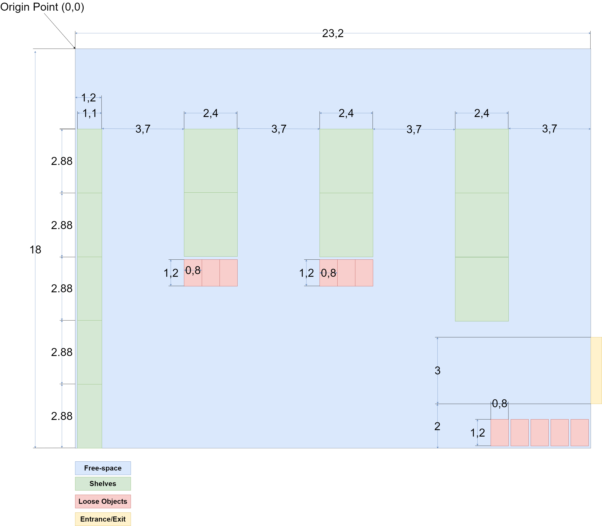

## Blueprint

This document contains explanations and motivations for the measurements as well as names for variables that should be used when designing the objects. The categories are mostly self explanatory, the one that might need more of an explanation is the color red. This refers to loose objects such as pallets, barrels, boxes and things that will be placed directly on the ground. 

**Measurements:**

| Category              | Part / Object         | Variable Name                 | Value [unit]  |
| :---                  | :----:                |    :----:                     |          ---: |
| Warehouse             | Walls                 | warehouse_length              | 23.2 [m]      |
| Warehouse             | Walls                 | warehouse_width               | 18 [m]        |
| Warehouse             | Walls                 | warehouse_height              | 6 [m]         |
| Warehouse             | Aisle                 | aisle_width                   | 3.7 [m]       |
| Warehouse             | Door                  | door_height                   | 4 [m]         |
| Warehouse             | Door                  | door_width                    | 3 [m]         |
| Warehouse             | Warehouse             | door_distance_to_wall         | 2 [m]         |
| Warehouse             | Shelf                 | shelf_distance_side_side      | 0 [m]         |
| Warehouse             | Shelf                 | single_shelf_wall_distance    | 0.1 [m]       |
| Warehouse             | Shelf                 | double_shelf_depth_distance   | 0.2 [m]       |
| Warehouse             | Shelf                 | shelf_total_length            | 2.88 [m]      |
| Warehouse             | Shelf                 | shelf_total_depth             | 1.1 [m]       |
| Warehouse             | Shelf                 | shelf_total_height            | 3 [m]         |

||
|:--:| 
| *The storage blueprint* |

TODO @Anders new blueprint

## Install instruction for BIM and Arch workbench

The warehouse was created in FreeCAD's BIM Workbench. This workbench isn't available by default but can easily be acquired by:

- Installing `pip3 install gitpython`
- Activating  `Tools` -> `Addon Manager` -> `BIM` -> `Install/update Selected`

Using the measurements found in the blueprint in the documentation folder I drew four lines and turned them into walls (line tool and wall tool respectively). By default the wall will be created around the line, so that the line is in the middle of the wall. This can be changed in the wall properties so that it ends up entirely on one side of the line.
As the blueprint lacked walls I used the dimensions specified there as the inner measurements, meaning that the origin point is located at the inner bottom left corner of the wall. All the inner space is in positive x and y coordinates, while the two of the walls are in negative coordinate space.
I used the Aligned Dimension tool from the Annotation tools to confirm that the inner measurements matched those of the blueprint.

While the BIM Workbench has support for door objects, they tend to act as solids when imported into gazebo, so the door is just a hole in the wall. This hole was created by adding a cube object and having it intersect the wall where the door should be located. Then you select the cube and the wall (in that order) in the tree view and press `Remove Component`. This should remove the cube object and create a hole where the cube and wall overlapped. The hole didn't appear in the right place, but it was possible to edit the position of the hole in its properties. I measured the location of the hole using Aligned Dimension to make sure it ended up in the right spot.

Going to the top view, I created a new rectangle object covering the whole warehouse. Then I turned it into a slab with the slab tool to create a floor for the warehouse.

Everything was added to a level object (note: by default this level object is named "Floor", but don't confuse it with the slab that constitutes the physical floor) so that it's grouped together. If we set the wall heights to 0 they will automatically inherit the height of the Level object, so we can change all the walls easily by changing the height of the level.

I added created two materials from presets, concrete and wood. I applied the concrete material to all walls and the wood material to the floor. These should be considered to be temporary placeholders.

Finally I exported the project as a Collada file (.dae) and added it into a simple .world file to see if it loaded properly in Gazebo, and the results seemed correct.

Since the warehouse will be static we shouldn't need to define any additional parameters like mass or inertia, visuals and collision should be enough. Textures might need some improvement as currently they're just basic colors but it should be possible to add those in FreeCAD and have them included in the .dae file so we can load them visually in Gazebo later.

I also added windows for slightly better visibility.

## Add warehouse to world-file

The floor of the warehouse goes below z=0 so the ground plane was lowered by 0.2 so that the warehouse still rests on top of it. As our simulations will mainly take place inside the warehouse the warehouse floor replaces the ground plane at z=0. The warehouse itself was placed in the models directory and loaded into the world with an `<include>` tag. Additionally the maze in the stage4 world was moved away from the origin so that it is fully contained inside the warehouse, though in the future it should be removed altogether.

## Resources

Warehouse Aisle width: [Aisle Width](https://www.conger.com/forklift-width/#:~:text=As%20you%20may%20recall%20from,standard%2048-inch%20pallets.)

